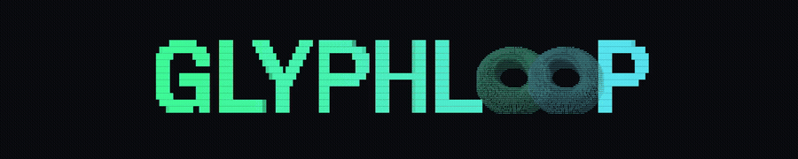

<p align="center"></p>

# Glyphloop

A browser studio and headless toolkit for creating **loop-perfect ambient ASCII
animations**: flow fields, wave interference, morphing noise blobs, matrix
rain, rotating 3D shapes, custom math expressions, and parametric surfaces.
Layer effects over images, video, or text, inherit their colors, and export to
PNG, GIF, MP4, self-contained web embeds, or terminal players.

Also usable **headless by AI agents** through the package CLI or MCP server -
agents can even define their own animations and 3D shapes as expression
strings. See [AGENTS.md](AGENTS.md).

Glyphloop = glyphs + seamless loops.

[Try the hosted studio](https://glyphloop.art/studio/) with no account, or
[see live examples](https://glyphloop.art/#sources).

## Local Studio

```sh
npm ci
npm run dev        # opens on http://localhost:5199
```

Node.js 20 or newer is required. Chrome is recommended because MP4 export uses
WebCodecs; the other workflows work in modern browsers.

## CLI and MCP

The package exposes one `glyphloop` executable with two commands:

```sh
npx glyphloop@beta render --preset flowfield-hero --out hero
npx glyphloop@beta mcp
```

From a source checkout, the equivalent development commands are:

```sh
npm run render -- --preset flowfield-hero --out hero
npm run mcp
```

`render` accepts a built-in preset name, a preset JSON file, or inline JSON.
Run `node bin/glyphloop.js --help` for the complete command summary.

## Use

1. Pick an effect source and tweak its parameters live - or **drag & drop
   any image/video onto the editor** to ASCII-fy your own design with its
   colors intact.
2. Style it: character ramp (or type your own), gamma, invert, mono or
   two-color gradient.
3. Set grid columns, cell size, aspect ratio, loop duration, and FPS.
4. **Export**:
   - **PNG** - current frame, at 1–3× scale.
   - **GIF / MP4** - one full loop, rendered deterministically frame-by-frame
     (never drops frames), seamless when it wraps.
   - **Web embed (zip)** - `frames.json` (RLE-compressed character frames) +
     `player.js` (tiny dependency-free player, honors
     `prefers-reduced-motion`) + a demo `index.html`. Drop the two files into
     any site and add `<div data-ascii-player></div>`.
   - **Terminal (zip)** - `frames.ans` + `play.sh`; run `bash play.sh` to loop
     the animation in a terminal.

The editor includes six starter presets. Presets can also be saved to
localStorage or downloaded/loaded as JSON via the header bar. A shared preset
can be opened with `/studio/?preset=flowfield-hero`.

Imported media stays in the browser; Glyphloop does not upload it. For a stable
beta experience, images are limited to 25 MiB and 40 decoded megapixels, videos
to 100 MiB and the first 20 seconds, and preset files to 10 MiB. Very large
render workloads are rejected with guidance to reduce scale, columns, FPS, or
duration.

The hosted website and Studio send a small allowlisted set of anonymous product
events to a first-party Cloudflare endpoint. Creative inputs and outputs are
never included. Source checkouts, the CLI, and the MCP server send no analytics.
See the hosted [privacy notice](https://glyphloop.art/privacy.html).

### Source color vs image palette

These are two different ways to color imported media:

- **Color mode: source** samples the image or video at every grid cell, so each
  glyph keeps the local color beneath it. It preserves multicolor artwork and
  follows changing video colors frame by frame.
- **Set ink & paper from image** extracts a small representative palette and
  fills the Ink, Ink 2, and Paper controls. Choose **mono** or **gradient** to
  render with those curated colors instead of retaining every source color.

In short: source mode preserves the image's color map; the palette action uses
the image as inspiration for a controlled Glyphloop color scheme.

## Why loops are seamless

Sources are pure functions of time with no per-frame state. All noise is
sampled along a circle in two extra noise dimensions
(`src/core/noise.ts:loopCoords`), and all sine phases advance by integer
multiples of 2π per loop - so frame N wraps back to frame 0 exactly. Exports
render `round(fps × duration)` frames starting at t=0 and never render
t=duration (frame 0 *is* the wrap).

## Development

```sh
npm test           # vitest unit tests (noise periodicity, mapper, RLE, ZIP, ANSI, sources)
npm run build      # typecheck + production build
npm run build:site # typecheck + production website and Studio build
```

Architecture: `Source → FieldFrame (brightness grid) → AsciiMapper → CanvasRenderer → exporters`.

## Licence, outputs, and brand

Glyphloop's software, including the editor, renderer, CLI, MCP server,
exporters, presets, and generated embed player, is available under the
[MIT licence](LICENSE).

Glyphloop claims no ownership in content you import or animations you export.
You may use exported animations commercially without attribution, subject to
any rights applicable to your source materials.

The Glyphloop name and visual identity are not licensed under MIT. Demo and
marketing media are separately labelled. See [TRADEMARKS.md](TRADEMARKS.md) and
[LICENSES/ASSETS.md](LICENSES/ASSETS.md).

Issues and focused feedback are welcome during the beta. See
[CONTRIBUTING.md](CONTRIBUTING.md) and [SECURITY.md](SECURITY.md).
